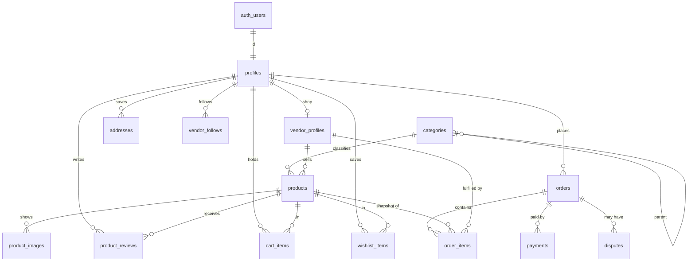
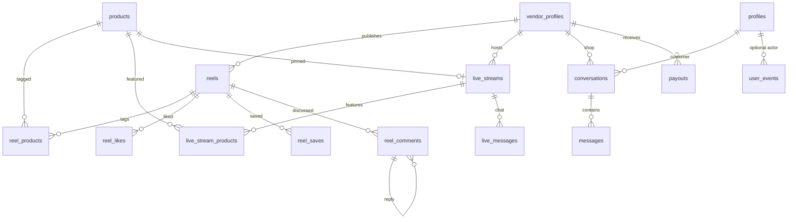

# Database

Paste the SQL files into the Supabase SQL editor in the order at the bottom of this document. The API uses the anon key. Row Level Security is the security boundary. These files do not create policies, fake users, or a `service_role` grant.

## Conventions

- Every table has a `uuid` primary key (`gen_random_uuid()`, except `profiles.id`, which is the auth user id) and `created_at` / `updated_at`.
- `set_updated_at()` stamps `updated_at` on every table.
- Money is `numeric(12,2)`. The default currency is `BDT`.
- Slugs are unique inside their own table and must match `^[a-z0-9]+(?:-[a-z0-9]+)*$`. The same slug may exist on a shop and on a product.
- Foreign keys are indexed. Status, `created_at`, and slug are indexed where those columns exist.
- `products.embedding`, `reels.embedding`, and `live_streams.embedding` are nullable `vector(768)`. The dimension may change when the embedding model is chosen. There is no ANN index yet.
- `products.search_vector` is a generated `tsvector` of title (weight A) and description (weight B), with a GIN index. The `simple` config keeps Bangla tokens intact. `pg_trgm` indexes also cover product titles, shop names, and category names.

## Signup and roles

`handle_new_user()` runs after insert on `auth.users`. It copies `full_name` and `avatar_url` only. The profile role is always `customer`. A client cannot send `role` in signup metadata and have it stick.

`guard_profile_role()` forces API inserts to `customer`. A later role change is allowed only for an existing admin, or from the SQL editor signed in as `postgres` / `supabase_admin`.

Promote the first admin only after that person has signed up:

```sql
update public.profiles
set role = 'admin'
where id = '<auth user uuid>';
```

Approving a shop does not change `profiles.role`. Set the role to `vendor`, then set `vendor_profiles.status` to `approved`.

## Row Level Security

`0012_rls_enable.sql` turns RLS on for every public table and creates no policies. The Data API therefore returns no rows and accepts no writes. The SQL editor bypasses RLS because it connects as the table owner. Do not `FORCE ROW LEVEL SECURITY`, or that bypass goes away.

`anon` and `authenticated` are granted table privileges so a later policy can allow a query. Privileges without a policy still deny the row.

These functions are `security definer` and bypass RLS on purpose:

- `handle_new_user()` inserts the customer profile at signup.
- `guard_profile_role()` reads whether the actor is an admin.
- The counter functions update only the maintained count columns.
- The integrity functions check shop ownership, review authorship, chat participants, comment parents, and dispute lines.

## ER overview





`orders.source_id` is not drawn as a foreign key. When `source` is `reel` it stores `reels.id`. When `source` is `live` it stores `live_streams.id`. When `source` is `direct` it is null.

## Tables

### profiles

One row per `auth.users` id. `role` is `admin`, `vendor`, or `customer`. `full_name`, `phone`, and `avatar_url` are optional. Deleting the auth user deletes the profile.

### vendor_profiles

One shop per profile (`profile_id` is the primary key). `status` is `pending`, `approved`, or `suspended`. `followers_count` is recounted from `vendor_follows`. Deleting the profile is blocked while the shop row exists (`ON DELETE RESTRICT`).

### categories

Unlimited tree through `parent_id`. Deleting a parent is blocked while children exist. `category_descendants(root_id)` returns that category at depth 0 and then every descendant. `prevent_category_cycle()` rejects a parent that would loop.

### products

Belongs to one shop and one category. Both foreign keys are `ON DELETE RESTRICT`. `status` is `draft`, `active`, or `archived`. `price` and optional `compare_at_price` are `numeric(12,2)` and cannot be negative. A compare-at price must be at least the current price. `stock` cannot be negative. SKU is unique per shop when it is present. `search_vector` and `embedding` are on this table. `avg_rating`, `reviews_count`, and `sales_count` are guarded. Only the review trigger writes the first two. Nothing writes `sales_count` yet.

### product_images

`storage_path` is the Storage object path, or a public URL. `sort_order` controls the gallery. At most one `is_primary` image per product. Images are deleted with the product.

### product_reviews

One review per customer per product. `rating` is 1 through 5. The shop that owns the product cannot review it. Insert, update, and delete recount `reviews_count` and `avg_rating`.

### addresses

Delivery addresses for a customer. `is_default` is unique per customer when true. Required location fields are `line1`, `city`, and `district`. `line2` and `postal_code` are optional.

### cart_items

One row per customer and product. `quantity` must be greater than 0. Deleting the customer or the product deletes the cart row.

### wishlist_items

One row per customer and product. No quantity.

### orders

`status` moves through `pending`, `paid`, `processing`, `shipped`, `delivered`, `cancelled`, and `refunded`. `payment_status` is `pending`, `paid`, `failed`, or `refunded`. `total` must equal `subtotal + shipping_fee`. There is no separate discount column yet. `currency` defaults to `BDT`. `shipping_address` is a JSON object snapshot (`recipient_name`, `phone`, `line1`, `line2`, `city`, `district`, `postal_code`). `source` is `direct`, `reel`, or `live`. Customer delete is blocked while orders exist.

The checkout writer must insert the order and its lines together. The database does not check that line totals sum to `subtotal`.

### order_items

Frozen `title` and `unit_price`. `line_total` is generated as `unit_price * quantity`. `item_status` is `pending`, `processing`, `shipped`, `delivered`, `cancelled`, or `refunded`. Product and shop foreign keys are `ON DELETE RESTRICT`, so catalog cleanup cannot erase order history. Deleting the order deletes its lines.

### payments

One row per provider attempt. `provider_reference` is unique. `amount` is `numeric(12,2)`. `raw_payload` is JSON for the provider response and must not contain card numbers or secrets. Deleting an order is blocked while a payment row exists.

### vendor_follows

A customer follows a shop. The pair is unique, and a shop cannot follow itself. Insert and delete recount `followers_count`.

### reels

A shop's short video. `status` is `draft`, `published`, or `removed`. A published reel must have `video_path`. `likes_count`, `comments_count`, and `saves_count` follow their child tables. `views_count` and `shares_count` are locked at 0 until a later trusted writer. `embedding` is present and unindexed. Deleting the shop is blocked while reels exist.

### reel_products

Tags a product on a reel. The pair is unique. The product must belong to the reel's shop.

### reel_likes and reel_saves

One like or save per user per reel. Deleting either side deletes the row and recounts the reel.

### reel_comments

`body` is required. `parent_id` is an optional reply on the same reel. Replies cannot cycle. `comments_count` includes replies. Deleting a comment deletes its replies.

### live_streams

`status` is `scheduled`, `live`, `ended`, or `removed`. A scheduled stream must have `scheduled_at`. `livekit_room_name` is unique and is the LiveKit room name, not an API secret. `pinned_product_id` is optional and must belong to the same shop. `peak_viewers` is locked at 0 for now. `ended_at` cannot be earlier than `started_at`. `embedding` is present and unindexed.

### live_stream_products

Products featured in a room, unique per stream and product, and limited to that shop's catalog.

### live_messages

Short chat lines for a room. `body` is limited to 500 characters.

### conversations and messages

One conversation per customer and shop. `product_id` only records which product opened the thread. `sender_id` must be the customer or the vendor on that conversation. `read_at` is null until the other side reads it. Deleting either participant deletes the thread and its messages.

### user_events

Append-only log for a later recommendation job. `user_id` is null for anonymous sessions and is set to null if that profile is deleted. `session_id` is required. `event_type` is `view`, `click`, `add_to_cart`, `purchase`, `like`, `save`, `search`, or `watch`. `entity_type` is `product`, `reel`, `live`, or `category`. `entity_id` is required except for `search`. This table does not update reel or product counters. Indexed by `(user_id, created_at)`.

### disputes

Opened against an order, optionally against one line. The line must belong to that order. `status` is `open`, `investigating`, `resolved`, or `rejected`. Orders, lines, and the opener profile cannot be deleted while a dispute points at them.

### payouts

A shop settlement for `period_start` through `period_end`. `amount` is `numeric(12,2)`. `status` is `pending`, `paid`, or `failed`. `reference` is unique once the bank or provider id exists. Deleting the shop is blocked while payouts exist.

### platform_settings

`key` / `value jsonb`. The migration inserts `commission_rate` (10 percent), `default_shipping_fee` (60 BDT), and `default_currency` (`BDT`). This table is not for secrets.

## Run order

1. `supabase/migrations/0001_extensions_enums.sql`
2. `supabase/migrations/0002_helper_functions.sql`
3. `supabase/migrations/0003_profiles.sql`
4. `supabase/migrations/0004_vendors_categories.sql`
5. `supabase/migrations/0005_catalog.sql`
6. `supabase/migrations/0006_customers.sql`
7. `supabase/migrations/0007_orders.sql`
8. `supabase/migrations/0008_reels.sql`
9. `supabase/migrations/0009_live.sql`
10. `supabase/migrations/0010_chat_events_ops.sql`
11. `supabase/migrations/0011_counter_and_integrity.sql`
12. `supabase/migrations/0012_rls_enable.sql`
13. `supabase/seed.sql`
14. `supabase/migrations/9999_checks.sql`

Paste each file as a whole. Stop if a file errors. Do not re-run a file that already succeeded.

`9999_checks.sql` is read-only. Every `status` should be `OK`. `categories seeded` is `FAIL` until `seed.sql` has been run.
